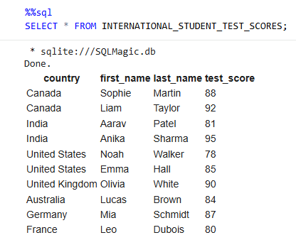
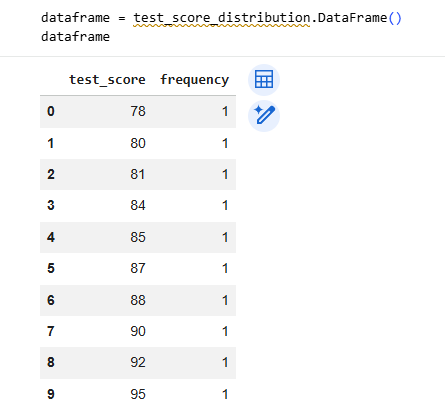
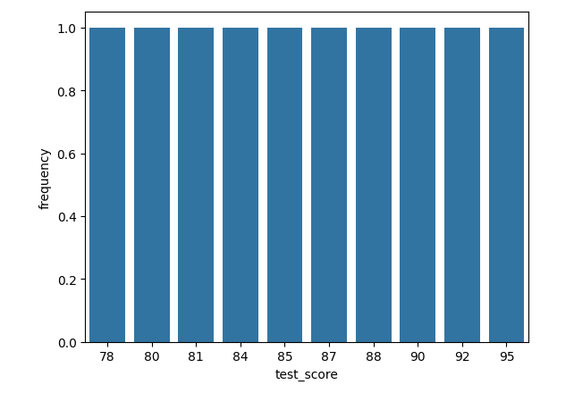

# sqlite-sql-magic-data-analysis
SQL and Python data analysis labs using SQLite and SQL Magic in Google Colab, including querying, data transformation, and visualization.
# SQL + Python Data Analysis Labs

This project demonstrates how to use SQL and Python together for data analysis using SQLite and SQL Magic in a Google Colab environment.

---

## Overview

This repository includes two hands-on labs that show different ways to work with databases:

### 🔹 1. SQLite with Python
File: `01_SQLite_Database_Operations.ipynb`

- Created a SQLite database using Python (`sqlite3`)
- Created tables and defined schema
- Inserted and updated records
- Queried data using SQL inside Python
- Retrieved results and displayed them in Python

---

### 🔹 2. SQL Magic in Jupyter/Colab
File: `02_SQL_Magic_Queries.ipynb`

- Used `%sql` and `%%sql` to run SQL directly in a notebook
- Queried and filtered data
- Used Python variables inside SQL queries
- Stored SQL results in Python variables
- Converted query results into a DataFrame
- Visualized data using a bar chart

---

## Tools & Technologies

- Python
- SQLite
- SQL (SELECT, WHERE, GROUP BY, COUNT)
- Google Colab / Jupyter Notebook
- Pandas
- Seaborn / Matplotlib

---

## Example Outputs

### 🔹 Table Output (Raw Data)

---

### 🔹 Grouped Query Result (Data Analysis)

---

### 🔹 Data Visualization (Test Score Distribution)

---

## Key Learnings

- How to create and manage a database using SQLite
- How to execute SQL queries using both Python and SQL Magic
- How to filter, aggregate, and analyze data using SQL
- How to integrate SQL results with Python workflows
- How to transform data into visual insights

---

## Future Improvements

- Work with larger and more complex datasets
- Add more advanced SQL queries (JOINs, subqueries)
- Build interactive dashboards for data exploration

---

## 👩‍💻 Author

Diane King  
UX/Product Designer transitioning into Data & AI
